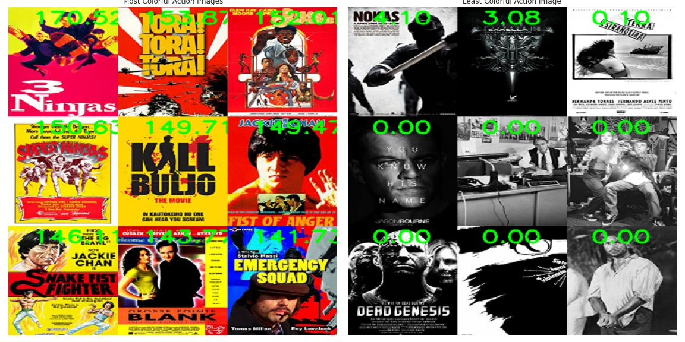
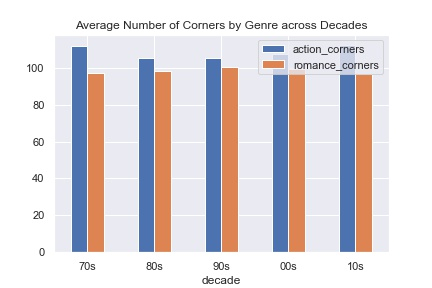
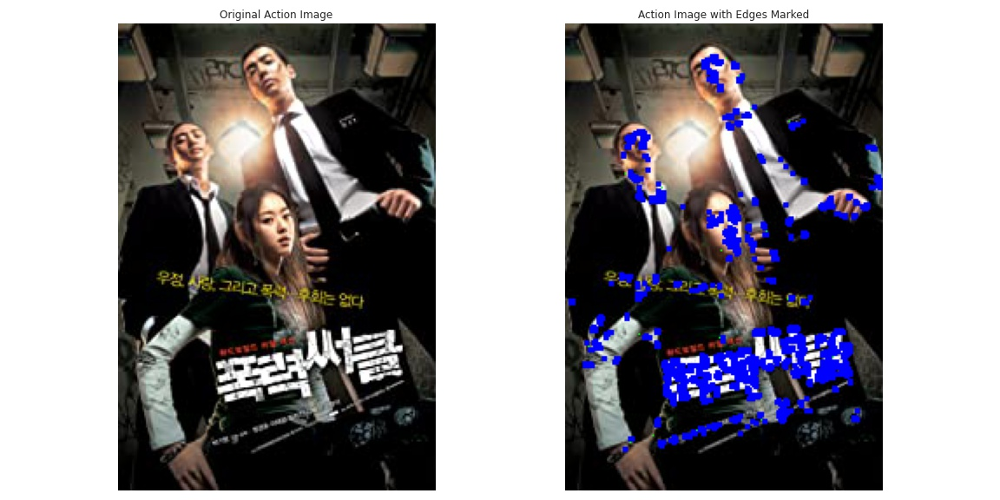
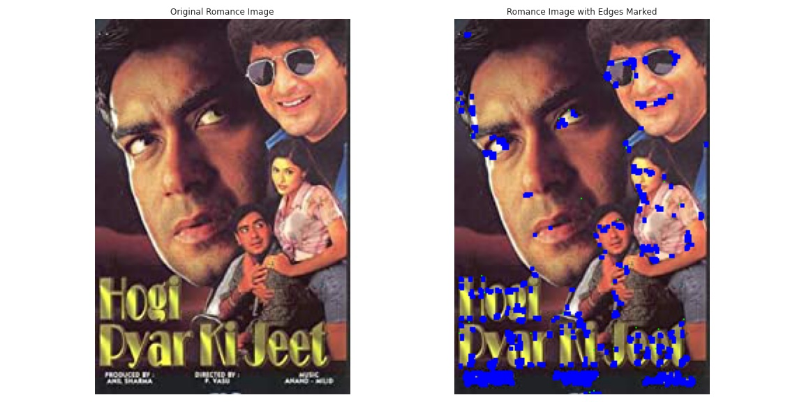

# Project Title

DSC160 Data Science and the Arts - Midterm Project Repository - Spring 2020

Project Team Members: 
- Luis Diaz, lmd003@ucsd.edu
- Catherine Hou, cahou@ucsd.edu
- Prithviraj Pahwa, pspahwa@ucsd.edu
- David Thierry, dthierry@ucsd.edu

## Abstract

(10 points) 

### Can we judge a movie by its cover?

The dataset that we are going to analyze comes from Kaggle (https://www.kaggle.com/neha1703/movie-genre-from-its-poster). These movie posters come from IMDB with features movie title, movie genre, and image link. We want to research whether we can classify these movies by their genre or year given their poster image. Our hypothesis is that we can classify which genre/year a movie comes from using features from the poster image. The features that we will use are hue, saturation, and brightness. Some more advanced features we can analyze are edges, entropy, and energy. skimage will be our main tool to process these images and extract their features. We will be using supervised learning to extract basic features to cluster these images by genre. We can plot these clusters onto a Bitmap plot. To analyze the accuracy of our classifier, we will plotting the accuracies by genre to see which genres the classifier works the best on. In the exercises we compared multiple features by plotting them onto different scatterplots, and we will expand on this by incorporating these features into a model. 
The cover images of movies are among the first things that consumers will see, so it is paramount for studios to create an art that can capture an audience's attention and convey what the movie is about. Movies have a rich culture with depth (going deep into history), and breadth (revelant worldwide). Personally we have all seen our fair share of movies, and this gives us a chance to analyze the features that go into their creation and whether these differences among genres are significant enough to be able to classify them.

## Data

(10 points) 
This section will describe your data and its origins. Each item should contain a name of the data source, a link to the source, and any necessary background information such as:
- What is your cultural data source? 
- When was it made? 
- Who created the works? 
- Is it digital native, or is it some kind of scan, recording, photo, etc., of an analog form? 

The data we will be using for this Midterm assignment will be the  MovieGenre.csv dataset obtained from Kaggle.com and can be accessed here (https://www.kaggle.com/neha1703/movie-genre-from-its-poster). The dataset is approximately 8.71 megabytes large in terms of memory. The data contains six columns: 

This MovieGenre.csv dataset was made using multiple sources.The creator of this dataset states that the IMDBid for movies was obtained through MovieLens, which is a non-commercial personalized movie recommendation. From this IMDBid data, the creator was able to webscrape IMDB.com for a collection of movie IMDBLinks, Titles, IMDB Scores, Genres and links to movie posters.

The author of this dataset appears to be a former student at the University of Massachusetts, Amhurst. There is no information on when the dataset was initially created, however, the dataset was last updated two years ago. Thus, the data contained in this dataset must be at the very least two or more years old.  

We believe that the data, specifically the image files which we are dealing with, to be digitally native. The reason we believe that the data is digitally native is because posters are much of the initial appeal when it comes to advertising a movie, and advertising works effectively at a large scale. In order to ensure that the poster is universally viewed, digitizing the poster so that it can be viewed almost anywhere seems like the most likely step forward. Because of this, these movie posters are optimized for display on digital screens, meaning that the posters were most likely generated digitally. 

## Code

(20 points)

This section will link to the various code for your project (stored within this repository). Your code should be executable on datahub, should we choose to replicate your result. This includes code for: 

- data acquisition/scraping
- cleaning
- analysis
- generating results. 

Link each of your notebooks or .py files within this section, and provide a brief explanation of what the code does. Reading this section we should have a sense of how to run your code.

[ETL Notebook](etl.ipynb) contains the code for extracting the links to the images, transforming the information into a dataframe/csv, and loading the images into a folder. It also includes the EDA, colorfulness, and corners feature extraction and analysis of the results.

[DownloadingAllImages Notebook](DSC160DownloadingAllImages.ipynb) contains the code for downloading posters of all the movies in our MovieData dataset to a local machine.

[FeatureExtraction Notebook](DSC160FeatureExtraction.ipynb) contains the code for extracting relevant features (Brightness, Colourfulness, Number of Corners etc.) and then combining those features in a dataframe indexed by movie ID. That dataframe is then downloaded to a local machine as All_Posters_Features.csv (found in the data folder). This csv will be used for building models.

[ModelEvaluation Notebook](ModelEvaluation.ipynb) contains the code for building different models to predict the genre of a movie using features collection from that movie's poster (found in All_Posters_Features.csv) and then analyze those results.

## Results

(30 points) 

This section will contain links to documentation of your results. This can include figures, sound files, videos, bitmaps, as appropriate to your domain of analysis. Each result should include a brief textual description, and all should be listed below: 

- image files (`.jpg`, `.png` or whatever else is appropriate)
- audio files (`.wav`, `.mp3`)
- written text as `.pdf`

### General Movie EDA

 
*This is a distribution of movie counts over each decade. The increase could either be attributed to more movies being rated on the website or in general more movies being released.*

 
*These are the counts of movies recorded by IMDB for each decade. Action movies have a greater presence in the 70s, 80s, and 10s, while romance movies were more present in the 90s and dominated the 00s.*

 
*These are the top ten recorded movie genres in IMDB and their associated counts.*

### Colorfulness of Movie Posters

 
*The average colorfulness for action and romance movies across the decades. Action movies usually have higher colorfulness values than romance movies do. With these two genres, there is less colorfulness in the 10s compared to the 70s.*

 
*These montages are of the movie image posters that had the top 9 (to the left) and the bottom 9 (to the right) colorfulness values for the action genre (on top) and for the romance genre (on bottom). The green numbers are the colorfulness values associated with each poster. We can see that the colorfulness for action tend to be higher than that for romance based on the top and bottom 9.*

### Corners of Movie Posters

 
*The average number of corners for action and romance movies across the decades. Action movies have consistently a slightly higher number of corners than romance movies. The number of corners detected by each decade does not seem to be changing significantly.*

 
*This is a sample of an action movie poster where on the left is the original poster and on the right are the corners plotted in blue according to the Harris Corner Detection method.*

 
*This is a sample of an romance movie poster where on the left is the original poster and on the right are the corners plotted in blue according to the Harris Corner Detection method. At least comparing these two alone, we can detect more corners in the action movie sample than in the romance movie sample.*

### Genre Classification - Single Genre Classification Results: 

A movie can belong to multiple genres. For instance, a rom-com is both a Romance and a Comedy movie. This means that our model must be able to produce multiple labels for the same features. To begin with, we will restrict our scope to movies which belong to only a single genre to simplify our analysis. As a further partitioning, due to heavy class imbalances in our dataset, we will restirct our scope to only the 4 most common genres of the single genre analysis, namely Comedy, Documentary, Drama and Horror.

Using these features, we built multiple machine learning models, with the best one usually being a Random Forest Classifier. The accuracy of our Random Forest Classifier usually hovered around 52-55% on the testing set. On 100 simulations of different partitionings of the data into training and testing sets, the mean accuracy was 54% and the relative feature importance can be seen in the following graph:

Furthermore, by examining our model more deeply, we can see that the model performs poorly on both Horror movies and Documentaries, does an okay job on Comedy movies while performing very well on Drama movies. We hypothesize that this might be due to differences in the features which will be examined below:

### Single Genre Feature Analysis:

We will the scaled means of 4 of the most important features for the different genres. The results are shown below:

The graph below represents the scaled standard deviations - 1 for 4 of the most important features for different genres:

As we can observe, there does seem to be a certain trend for the different genres. Comedy movies seem to be very bright and colourful while Horror movies seem to have very low brightness on average. Furthermore, Documentaries and Drama movies seem to be similar which matches up with our intuition. With regards to variability in features, Comedy movies and Documentaries seem to have fairly high variability in features while both Horror movies and Drama movies seem to have less variability.

### Genre Classification - Multi Genre Classification Results:

We also attempted a multi-label multi-class classification to see whether our model can also be useful in predicting the genres of movies that have more than one genre. We again used a Random Forest Classifier to make our predictions. However, the results of this task were far less encouraging, with our accuracy (which we defined as being able to predict at least 1 of the genre labels correctly) hoevered around 20% for all the genres (which totaled 28). To lessen the impace of class imbalances, we looked at only the 6 most common genres, namely Action, Comedy, Crime, Drama, Romance and Thriller. This lead to slightly increased accuracies around 30%. However, considering this is a cultural anlytics project, we wanted to see the relative feature importances for all the different genres. Below is a plot outlining the feature importances for the different genres:

## Discussion

(30 points, three to five paragraphs)

The first paragraph should be a short summary describing your results.

The subsequent paragraphs could address questions including:
- Why is this culturally relevant?
- How does your computational approach differ from the traditional art historical, musicological, manuel/subjective approach to analyzing your cultural subject? 
- How do you think the original artists/musicians would respond to this type of analysis? Would it change/inform their practice in some way?
- How do your results relate to broader social, cultural, economic political, etc., issues? 
- In what future directions could you expand this work?

 
&nbsp;&nbsp;&nbsp;&nbsp;&nbsp;&nbsp;#TODO - Short Summary of Results\
&nbsp;&nbsp;&nbsp;&nbsp;&nbsp;&nbsp;We believe our project to be culturally relevant in the sense that being able to quantify the aspects of a movie poster that allow more accurate genre prediction allows for better understanding of initial impressions. Humans can grasp the cues like color, expressions on the faces of actors etc to quickly determine the genre (horror, comedy, animation etc). It has been shown that color characteristics of an image like hues, saturation, and brightness affect human emotions. If humans are able to predict the genre of a movie by a single glance at its poster, then we can assume that the color characteristics, local texture based features and structural cues of posters possess some characteristics which could be utilized in machine learning algorithms to predict its genre. Our approach differs from traditional approaches in a sense that traditional approaches to genre prediction typically depend on the subjective opinion of the individual viewing the visualization itself, whereas attempting to model genre based on features allows us to get more understanding of what characteristics are more influential than others in the general sense. We also explored features outside what we have explored in class: corner detection and colorfulness, and although we didn't find significant differences across decades, there is a gap in these metrics when comparing genres, which in this case was action and romance movies.\
&nbsp;&nbsp;&nbsp;&nbsp;&nbsp;&nbsp;Assuming that we obtained relevant results, we believe that original producers would respond to this type of analysis in an immediately applicable way. For movie viewers, the movie posters are typically one of  the first impressions, and it is essential from the movie producers perspective that the movie poster elicit an emotional response. By showing that we are able to classify a movie’s genre by using that respective movie poster, we believe that the movie industry would begin to focus more on the objective quality of their posters rather than subjective quality. In other words, by being able to classify movies genre from movie poster, we have data on what features lead to a specific genre. From this, movie producers will tailor their movie poster to include many more of these traits in order to convey the correct message to the potential movie viewer. This way, producers can be assured that they are marketing their product in an optimal way to the target audience of their choice. An example would be examining the colorfulness of an image because they could test whether more colorful images draw attention from more people. Colorfulness is usually a subjective metric, but a paper referenced in this blog post [Computing image "colorfulness"](https://www.pyimagesearch.com/2017/06/05/computing-image-colorfulness-with-opencv-and-python/) manages to derive a metric that correlates to what people's idea of colorfulness is. We could also look at corner detection and apply that same concept to find that ideal balance between too many, too little, and just enough corners. What is unique about corners is that it is where two edges meet and is much easier to identify a corner than other features in an image.\
&nbsp;&nbsp;&nbsp;&nbsp;&nbsp;&nbsp;Our results bring to light other possible applications of the concepts utilized in this work. For example, instead of identifying underlying relationships between movie posters and movie genres to predict genre, there is potential for understanding relationships between political propaganda and the political affiliation of that propaganda. In the case of political propaganda, certain characteristics may coincide more with one affiliation than more than it does with others. From this gained understanding of what visual aspects pertaining propaganda matter, the visualization of these messages can be altered in order to convey an altered impression or message. Furthermore, because political propaganda can intend to have either negative or positive to a specific affiliated group, the ability to target certain audiences through implicit differences (such as the features we extracted) allows for much more promising results.\
&nbsp;&nbsp;&nbsp;&nbsp;&nbsp;&nbsp;Our work definitely has room for improvement. In the future, we plan to incorporate more complex features (extracted from the movie posters themselves) into our model in hopes of obtaining better classification scores. Another potential extension to this work which could lead to better results would involve an unsupervised learning approach. The rationale behind using unsupervised learning is that we wish to find the inherent structure of our data without using explicitly-provided labels. By using this approach, we can compare our results between the former model and the latter to understand any relationships that we may have missed that could benefit our former model. We could extend our work for colorfulness by diving deeper into more genres and finding patterns to see if we could use this to support our classification. For corner detection, we could try to grab the features of these specific corners and see if we can detect titles or objects based on a corner.
Furthermore, another approach could be. 
&nbsp;&nbsp;&nbsp;&nbsp;&nbsp;&nbsp;Our work definitely has room for improvement. In the future, we plan to incorporate more complex features (extracted from the movie posters themselves) into our model in hopes of obtaining better classification scores. Another potential extension to this work which could lead to better results would involve an unsupervised learning approach. The rationale behind using unsupervised learning is that we wish to find the inherent structure of our data without using explicitly-provided labels. By using this approach, we can compare our results between the former model and the latter to understand any relationships that we may have missed that could benefit our former model. We could extend our work for colorfulness by diving deeper into more genres and finding patterns to see if we could use this to support our classification. For corner detection, we could try to grab the features of these specific corners and see if we can detect titles or objects based on a corner. Furthermore, another approach to help us improve our accuracy could be in using deep learning to help predict the genre/decade of the movie. By using a Convolutional Neural Network, we may be able to extract much more detailed features that we haven't been able to extact in this preliminary analysis. A downside of this approach would be that we wouldn't be able to observe the feature importances using this approach as we were able to for the Random Forest Classifier.

### Note 
(First Paragraph and Last Paragraph may need improvement)

## Team Roles

Provide an account of individual members and their efforts/contributions to the specific tasks you accomplished.

- Catherine worked on the general movie EDA and the feature extraction/analysis for colorfulness and corner detection. Work can be seen in the [ETL Notebook](etl.ipynb).
- David helped with feature selection and data cleaning. Also worked on the discussion prompts and helped format repository for submission. 

## Technical Notes and Dependencies

Any implementation details or notes we need to repeat your work. 
- Additional libraries you are using for this project
- Does this code require other pip packages, software, etc?
- Does this code need to run on some other (non-datahub) platform? (CoLab, etc.)
- In addition to pandas, numpy, matplotlib, and seaborn, the [ETL Notebook](etl.ipynb) requires OpenCV, glob, skimage, and imutils.

## Reference

References to any papers, techniques, repositories you used:

Papers
- http://cs229.stanford.edu/proj2019spr/report/9.pdf

Repositories
-  Haralick, Local Binary Patterns, PFTA, Zernlike Moments: https://mahotas.readthedocs.io/en/latest/features.html#global-features
- SURF (Speeded Up Robust Features): https://mahotas.readthedocs.io/en/latest/features.html#global-features

Blog posts
- [Computing image "colorfulness"](https://www.pyimagesearch.com/2017/06/05/computing-image-colorfulness-with-opencv-and-python/) from PyImageSearch that computes the colorfulness metric described in Hasler and Süsstrunk’s 2003 paper.
- [Measuring colorfulness in natural images](https://infoscience.epfl.ch/record/33994/files/HaslerS03.pdf).
- [Harris Corner Detection Documentation](https://opencv-python-tutroals.readthedocs.io/en/latest/py_tutorials/py_feature2d/py_features_harris/py_features_harris.html) from OpenCV that detects the corners in an image.
